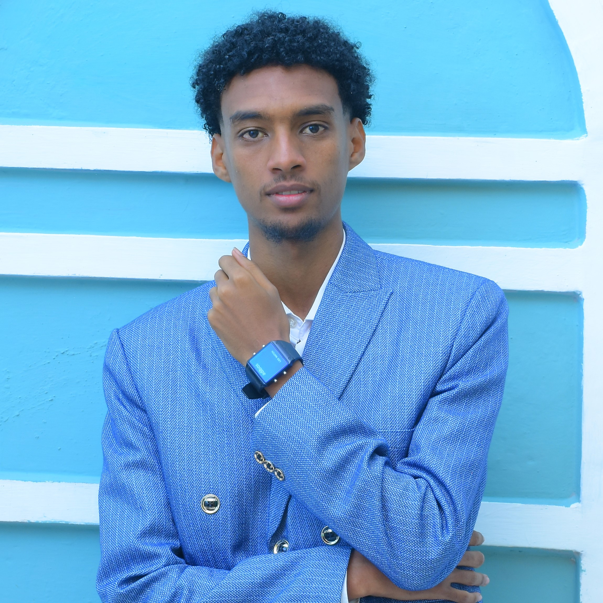

# Haftom Giday — Developer Portfolio

A sleek, premium, and fully responsive personal portfolio designed for a Full-Stack and Mobile App Developer. The design features a modern dark aesthetic with royal blue accents, glassmorphism UI elements, and smooth scroll animations.

 *(Update preview link once deployed)*

## ✨ Features

- **Modern Hero Section**: Animated typewriter effect, floating stat badges, glowing orbital rings, and CV download integration.
- **Glassmorphism UI**: Beautiful, subtle blur effects on project cards, skill tabs, and contact forms.
- **Interactive Project Showcase**: 3D parallax hover effects on project cards.
- **Scroll-Triggered Animations**: Elements smoothly reveal themselves using the Intersection Observer API for performance.
- **Dynamic Skills Tabs**: Categorized technical skills (Frontend, Backend, Mobile, etc.) with animated progress bars.
- **Real-World Timeline**: Clean, elegant vertical timelines for Work Experience and Education.
- **Fully Responsive**: Mobile-first design that looks pixel-perfect on phones, tablets, and massive desktop displays.
- **Zero Dependencies**: Built 100% with Vanilla HTML, CSS, and JS. No NPM, Webpack, or heavy frameworks required.

## 🛠️ Built With

- **HTML5**: Semantic tags and clean structure.
- **CSS3**: Custom variables, Grid/Flexbox layouts, clamp() for responsive typography, and heavy use of transitions and transforms.
- **JavaScript (ES6+)**: Custom animations, DOM manipulation for skill tabs, form validation, and scroll observations.

## 🚀 Quick Start & Setup

Because this project is built entirely with vanilla web technologies, there is **zero build step**. 

1. **Clone the repository:**
   ```bash
   git clone https://github.com/Haftom-Dreamer/FUTURE_FS_01.git
   ```
2. **Navigate into the directory:**
   ```bash
   cd FUTURE_FS_01
   ```
3. **Open locally:**  
   Simply double-click on `index.html` to open it in your default web browser, or use a local development server like Live Server (VS Code) or Python:
   ```bash
   python3 -m http.server 8080
   ```
   Then navigate to `http://localhost:8080/`.

## ✏️ Customization Guide

This portfolio is highly modular and easy to modify for your own needs.

### 1. Colors & Theme
All master colors are stored as CSS variables at the top of `style.css` inside the `:root` pseudo-class.
```css
:root {
  --bg-dark: #05050f;
  --royal-blue: #2463EB;
  --royal-light: #60A5FA;
  /* Change these values to instantly alter the global theme */
}
```

### 2. Updating Profile Information
- **Hero Image:** Replace `assets/img/DSC_7127.JPG` with your own photo.
- **CV Profile:** Add your resume PDF to `assets/cv/Haftom_Giday_CV.pdf`.
- **Social Links:** Update your GitHub, LinkedIn, Instagram, and X (Twitter) URLs directly in the contact section within `index.html`.

### 3. Contact Form
The contact form UI is currently static. To make it functional, point the `<form action="...">` to a form-handling service like [Formspree](https://formspree.io/) or [Netlify Forms](https://docs.netlify.com/forms/setup/).

## 📫 Contact

Created by **Haftom Giday** — Full-Stack & Flutter Developer.
- 🐙 [GitHub](https://github.com/Haftom-Dreamer)
- 💼 [LinkedIn](https://linkedin.com)
- ✉️ haftom@example.com

---

*This project was developed iteratively with a focus on high-fidelity design, modern code practices, and maximum browser compatibility.*
